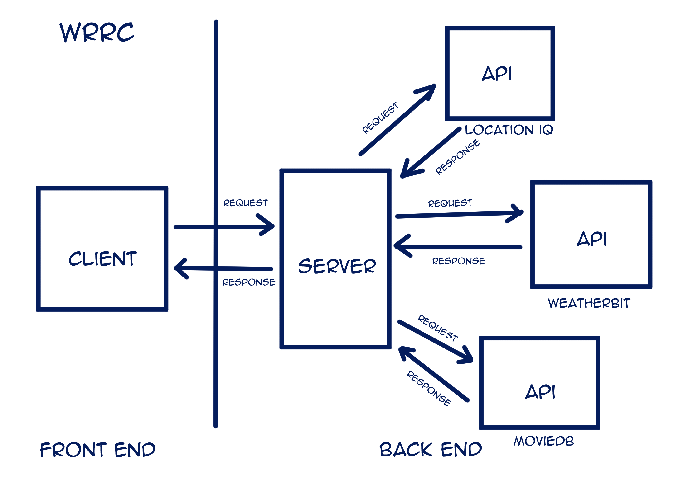

# City Explorer

**Author**: Dana Huffman

**Version**: 1.3.0

## Overview

This app is designed to allow a user to input a city name and retrieve information about said city.

## Getting Started

- Run `npm install`
- Add your API key to .env.sample

## Architecture

Created using Node, React, Bootstrap, JavaScript, CSS, HTML, and Axios

## Change Log

05-16-2022 2:58pm - Completed initialization of project
05-16-2022 4:06pm - Completed Location Search feature - added styling for location Card
05-16-2022 6:35pm - Added map to location search feature
05-16-2022 7:03pm - Added error catch feature
05-17-2022 7:20pm - Added weather API call
05-18-2022 4:55pm - Added new data to weather display
05-18-2022 8:36pm - Added display for movie data
05-19-2022 5:20pm - Added WeatherDay and Movie

## Credit and Collaborations

 Made with [Provida Powell](https://github.com/Vida-1)

[class demo](https://github.com/codefellows/seattle-code-301d85/tree/main/class-06/in-class-demo/api-call)

[trello board template](https://trello.com/b/Ajj9Cbac/module-2-city-explorer)

[bootstrap component guide](https://react-bootstrap.github.io/components/cards)

 Made with [Denis Rendon](https://github.com/DenisRendon) and [Cheri Hodge](https://github.com/cheriezus)

 Made with [Elizabeth Hammes](https://github.com/ehammes)

[class demo](https://github.com/codefellows/seattle-code-301d85/tree/main/class-08/in-class-demo/image-finder-front-end)

 Made with [Vinny Shipley](https://github.com/VinnyShipley)

## Time Estimates

Name of feature: **#1 Location Search**

Estimate of time needed to complete: 30 min

Start time: 3:06

Finish time: 3:54

Actual time needed to complete: 48 min

Name of feature: **#2 Map**

Estimate of time needed to complete: 20 min

Start time: 4:24

Finish time: 5:59

Actual time needed to complete: 1 hour 35 min

Name of feature: **#3 Errors**

Estimate of time needed to complete: 20 min

Start time: 6:38

Finish time: 7:02

Actual time needed to complete: 24 min

Name of feature: **#4 Componentize**

Estimate of time needed to complete: 45 min

Start time: 4:35

Finish time: 5:17

Actual time needed to complete: 42 min
